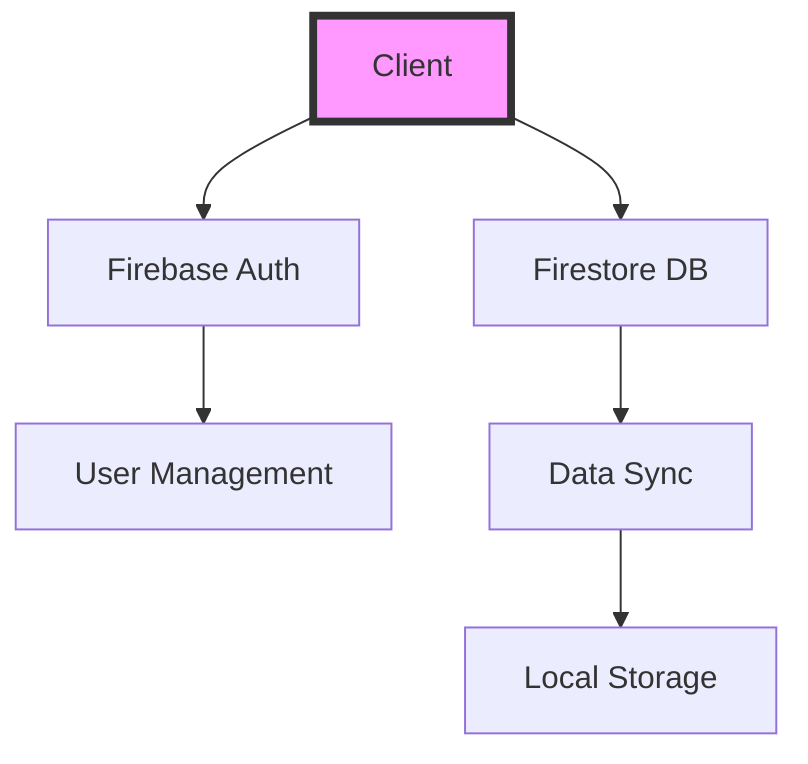

<div align="center">

# 🌟 Modern Firebase Dashboard

<p align="center">
  
  
  
  
  
  
</p>

<p align="center">
  <a href="#-demo">Demo</a> •
  <a href="#-features">Features</a> •
  <a href="#-quick-start">Quick Start</a> •
  <a href="#-installation">Installation</a> •
  <a href="#-documentation">Documentation</a>
</p>

<p align="center">
  
</p>

</div>

## 🎯 Overview

A powerful, modern dashboard built with Firebase, featuring a stunning dark/light mode interface and robust data management capabilities. Perfect for managing notes, links, passwords, and contacts in a secure, cloud-synchronized environment.

## ✨ Live Demo

🔗 [View Live Demo](https://caaqilyare.github.io/firebase-login-html/)

### 🔑 Quick Access
```bash
Email    : test@admin.com
Password : test123
```

> ⚠️ **Demo Account Notice**
> - Shared test environment - Please be considerate
> - Data is publicly visible
> - For personal use, set up your own instance

## 🚀 Features

<details>
<summary>🎨 Beautiful UI/UX</summary>

- Sleek, modern interface with smooth transitions
- Responsive design for all devices
- Dark/Light mode with system preference detection
- Intuitive navigation and controls
</details>

<details>
<summary>📝 Data Management</summary>

- **Notes**
  - Rich text formatting
  - Real-time sync
  - Quick search

- **Links**
  - URL metadata fetching
  - Quick copy & share
  - Custom categories

- **Passwords**
  - Secure storage
  - Strength indicators
  - Auto-generate strong passwords

- **Contacts**
  - Comprehensive contact info
  - Quick actions (call, email)
  - Contact grouping
</details>

<details>
<summary>🛡️ Security Features</summary>

- Firebase Authentication
- Real-time data encryption
- Secure password handling
- Protected routes
- User-specific data isolation
</details>

## 🏗️ Architecture



## 📁 Project Structure

```bash
firebase-login-html/
├── 📂 components/              # UI Components
│   ├── 📄 dashboard.html      # Main Interface
│   └── 📄 ...
├── 📂 js/                     # Logic Layer
│   ├── 📄 auth.js            # Authentication
│   ├── 📄 items.js           # Data Management
│   ├── 📄 modal.js           # UI Interactions
│   ├── 📄 theme.js           # Theming System
│   └── 📄 components.js      # Component Logic
├── 📂 styles/                 # Styling
│   └── 📄 main.css           # Global Styles
├── 📄 index.html             # Entry Point
└── 📄 index.js               # Main Script
```

## ⚡ Quick Start

1️⃣ **Clone & Install**
```bash
git clone https://github.com/YOUR_USERNAME/firebase-login-html.git
cd firebase-login-html
```

2️⃣ **Firebase Setup**
```bash
# Create firebase-config.js in js/ directory
export const firebaseConfig = {
  apiKey: "YOUR_API_KEY",
  authDomain: "YOUR_PROJECT.firebaseapp.com",
  projectId: "YOUR_PROJECT",
  // ... other config
};
```

3️⃣ **Launch**
```bash
# Using any HTTP server
python -m http.server 8000
# Or
php -S localhost:8000
```

## 🔧 Firebase Configuration

<details>
<summary>📝 Step-by-Step Setup</summary>

1. Visit [Firebase Console](https://console.firebase.google.com/)
2. Create New Project
3. Enable Services:
   - Authentication (Email/Password)
   - Firestore Database
4. Get Configuration:
   ```javascript
   // js/firebase-config.js
   export const firebaseConfig = {
     apiKey: "xxx",
     authDomain: "xxx",
     projectId: "xxx",
     storageBucket: "xxx",
     messagingSenderId: "xxx",
     appId: "xxx"
   };
   ```
5. Initialize Firebase:
   ```html
   <script type="module">
     import { firebaseConfig } from './js/firebase-config.js';
     firebase.initializeApp(firebaseConfig);
   </script>
   ```
</details>

## 🔐 Security Rules

```javascript
rules_version = '2';
service cloud.firestore {
  match /databases/{database}/documents {
    match /users/{userId}/{document=**} {
      allow read, write: if request.auth != null 
                        && request.auth.uid == userId;
    }
  }
}
```

## 🎨 Theme Customization

```javascript
// Customize Tailwind Theme
tailwind.config = {
  darkMode: 'class',
  theme: {
    extend: {
      colors: {
        dark: {
          100: '#1E293B',
          // ... other shades
        }
      }
    }
  }
}
```

## 📱 Browser Support

| Browser | Support |
|---------|---------|
| Chrome  | ✅      |
| Firefox | ✅      |
| Safari  | ✅      |
| Edge    | ✅      |

## 🤝 Contributing

We welcome contributions! Here's how:

1. Fork the Project
2. Create Feature Branch
   ```bash
   git checkout -b feature/AmazingFeature
   ```
3. Commit Changes
   ```bash
   git commit -m 'Add AmazingFeature'
   ```
4. Push to Branch
   ```bash
   git push origin feature/AmazingFeature
   ```
5. Open Pull Request

## 📜 License

This project is licensed under the MIT License - see the [LICENSE](LICENSE) file for details.

## 🌟 Support

If you found this project helpful, please consider:
- ⭐ Starring the repository
- 🐛 Reporting bugs
- 💡 Suggesting new features

---

<div align="center">

Made with ❤️ by Munasar Abuukar

</div>
